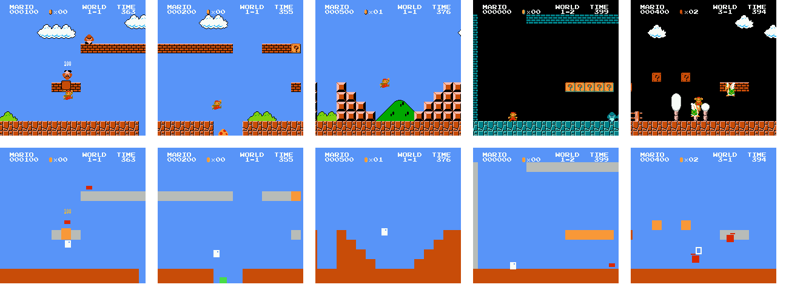

# Mario stimuli, simplified

A copy of the gym-retro integration for Super Mario Bros (NES) used in the
Courtois NeuroMod *mario* dataset, with the same level savestates, scenario and
RAM variable map, but a **visually simplified ROM**: every non-interactive
background detail is transparent, every interactive block is a flat square,
and every sprite object (Mario, enemies, items, fireballs) is a flat rectangle
the exact size and position of its collision box. Colour encodes the semantic
category, and a handful of simple shapes encode the game states that colour
cannot (facing direction, dying, shells, non-stompable enemies, wings).

The ROM plays exactly like the original. Participant replays (`.bk2`) and
savestates recorded on the original ROM run byte-for-byte identically on it
(only the rendered image differs), so the simplified version can be used as a
visual-complexity control for both human and AI gameplay.



See [docs/METHOD.md](docs/METHOD.md) for the full description of the method,
its verification, the inventory of what semantic information is kept or lost,
and the known limitations.

## Colour legend

| Category | Colour | Objects |
|---|---|---|
| background | sky blue | everything non-interactive (transparent) |
| terrain | brown | ground, stairs, hard blocks, pipes, tree and mushroom ledges, cloud terrain, cannons, bridges, used blocks, moving platforms, springboards, vines |
| brick | grey | breakable bricks |
| ?-block | orange | question blocks, sprite of a bumped block |
| coin | yellow | coins in the level, coins popping out of blocks, floating score numbers |
| item | green | super mushroom |
| 1-up | dark green | 1-up mushroom |
| star | cyan | starman |
| enemy | red | every enemy and enemy projectile |
| Mario | white | the player (flashes white / green / orange with star power) |
| fire Mario | pale pink | Mario after a fire flower, his fireballs, and the fire flower itself |
| goal | purple | flagpole, ball, flag, axe, flagpole score |

## Shape legend

| Shape | Meaning |
|---|---|
| rectangle size | the object's collision box: big Mario 12x24, small Mario 10x12, crouching 12x12, Koopa-class enemies and items 12x12, Goomba-class enemies 10x6, Hammer Bro 8x24, fireballs and hammers 8x8 |
| 2x2 hole near the top edge of Mario | the side Mario faces |
| hollow rectangle | a Koopa or Buzzy shell (kickable), or Mario dying |
| toothed top edge | an enemy that cannot be stomped (Spiny, Spiny egg, Piranha Plant) |
| 8x2 bar just above an enemy | a Paratroopa (winged; needs two stomps) |
| 16x4 bar on the ground | a squished Goomba (harmless, about to vanish) |
| horizontal stripes | the springboard |

## Contents

| Path | What it is |
|---|---|
| `SuperMarioBros-Nes/rom.nes` | the simplified ROM (git-annex) |
| `SuperMarioBros-Nes/rom.sha` | sha1 of the ROM body (without iNES header), as gym-retro expects |
| `SuperMarioBros-Nes/Level*.state` | level savestates, unchanged from `mario.stimuli` |
| `SuperMarioBros-Nes/data.json`, `scenario.json`, `metadata.json` | RAM variables, reward/done definition, agent benchmarks, unchanged |
| `code/simplify_rom.py` | builds the simplified ROM from the original ROM (the tile, colour, collision-box and shape tables live here) |
| `code/verify_replays.py` | replays `.bk2` recordings on two ROMs and checks RAM identity and savestate portability |
| `code/survey_sprite_tiles.py` | measures which sprite tile belongs to which object, used to build the sprite colour table |
| `code/hitbox_survey.py` | measures where each sprite tile sits relative to its object's collision box, used to build the `HITBOX` table |
| `code/fix_state_palette.py` | rewrites the palette stored inside a savestate or a recording's `Core.bin` (needed for recordings that start mid-level, see below) |
| `generate_sublevels.py` | original helper that regenerates level states |
| `paper/` | manuscript draft (LaTeX) |

## Rebuilding the ROM

```
python code/simplify_rom.py /path/to/original/rom.nes SuperMarioBros-Nes/rom.nes
tail -c +17 SuperMarioBros-Nes/rom.nes | sha1sum | cut -d' ' -f1 > SuperMarioBros-Nes/rom.sha
```

The original ROM is the one annexed in `mario.stimuli`
(md5 `811b027eaf99c2def7b933c5208636de`). The current simplified ROM has md5
`f80e6aa2039a68ddd8258a21d3741738`. `--no-hitbox` gives full-size squares
instead of collision-box rectangles, `--no-marks` removes the shape cues.

## Checking a ROM against recordings

```
python code/verify_replays.py integrations/SuperMarioBros-Nes-orig integrations/SuperMarioBros-Nes-simple sub-01_ses-001_task-mario_level-w1l1_rep-000.bk2
```

where each integration folder holds a `rom.nes` next to copies of this repo's
`*.json` and `*.state` files. Requires stable-retro.

## Replaying existing recordings on the simplified ROM

The game writes its palettes only when an area loads, and a recording's
initial savestate (`Core.bin`) carries the palette that was in the PPU when it
was captured, i.e. the original colours. 3231 of the 3374 dataset recordings
start on the black "WORLD x-y" screen, so the level's palette is written a few
frames later and they render correctly. The other 143 (mostly the first
repetition of a run) start in gameplay and would keep the original colours
until the next area change. Rewrite their initial state before replaying:

```
unzip -p recording.bk2 Core.bin > Core.bin
python code/fix_state_palette.py Core.bin Core.fixed.bin
```

(or call `fix_state_palette.fix()` on the bytes). The rewrite changes nothing
but the 32 palette bytes; the run is RAM-identical afterwards.
